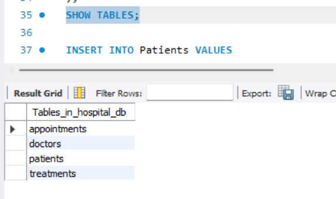
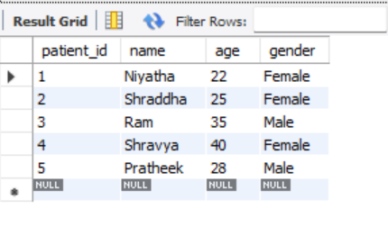
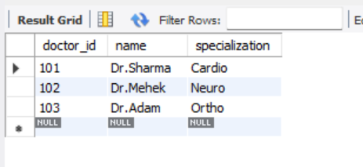
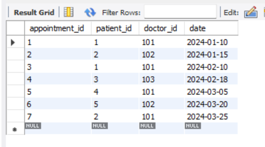
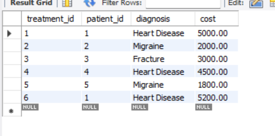
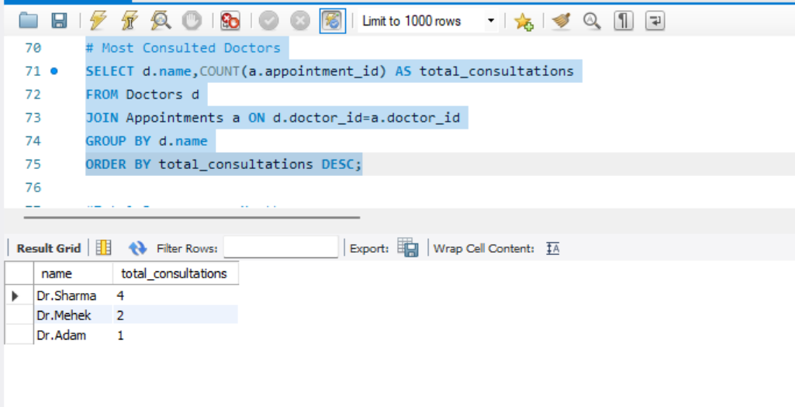
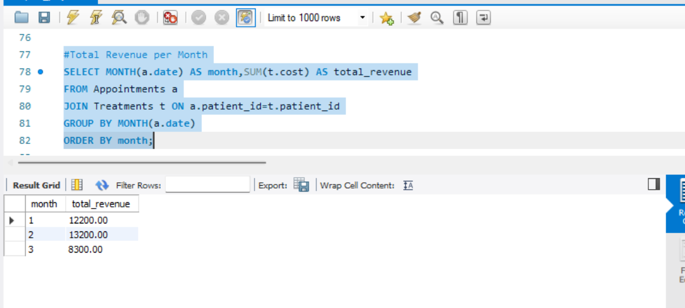
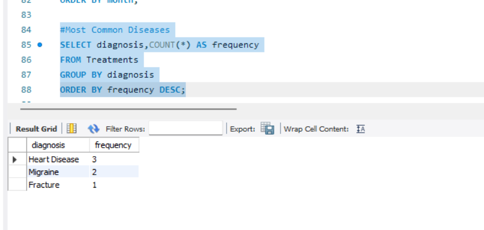
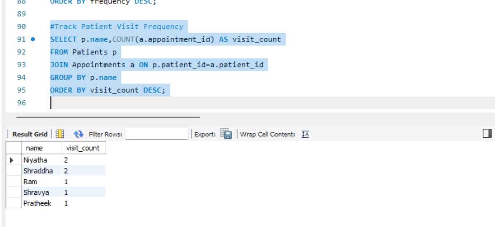
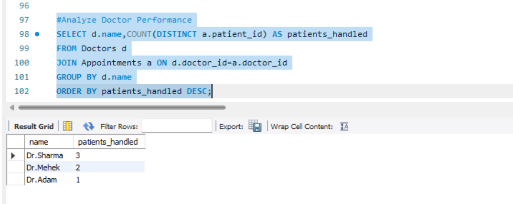

# Hospital Management & Patient Analytics System

##  Project Description
This project is a SQL-based Hospital Management System designed to store and analyze hospital data. It manages information related to patients, doctors, appointments, and treatments, and performs analytical queries to extract useful insights.

---

##  Database Structure

The database consists of the following tables:

- **Patients** – Stores patient details (ID, name, age, gender)  
- **Doctors** – Stores doctor details (ID, name, specialization)  
- **Appointments** – Tracks patient visits to doctors  
- **Treatments** – Stores diagnosis and treatment cost  

---

##  Features & Queries

The project includes the following analytical queries:

1. **Most Consulted Doctors**  
   Identifies doctors with the highest number of appointments  

2. **Total Revenue Per Month**  
   Calculates monthly revenue based on treatment costs  

3. **Most Common Diseases**  
   Finds frequently occurring diagnoses  

4. **Patient Visit Frequency**  
   Tracks how often each patient visits the hospital  

5. **Doctor Performance Analysis**  
   Measures number of unique patients handled by each doctor  

---

##  Screenshots

###  Tables

- Tables Overview  
  

- Patients Table  
  

- Doctors Table  
  

- Appointments Table  
  

- Treatments Table  
  

---

###  Query Outputs

- Most Consulted Doctors  
  

- Total Revenue Per Month  
  

- Most Common Diseases  
  

- Patient Visit Frequency  
  

- Doctor Performance  
  

---

##  Tools Used

- MySQL Workbench  
- SQL  

---
